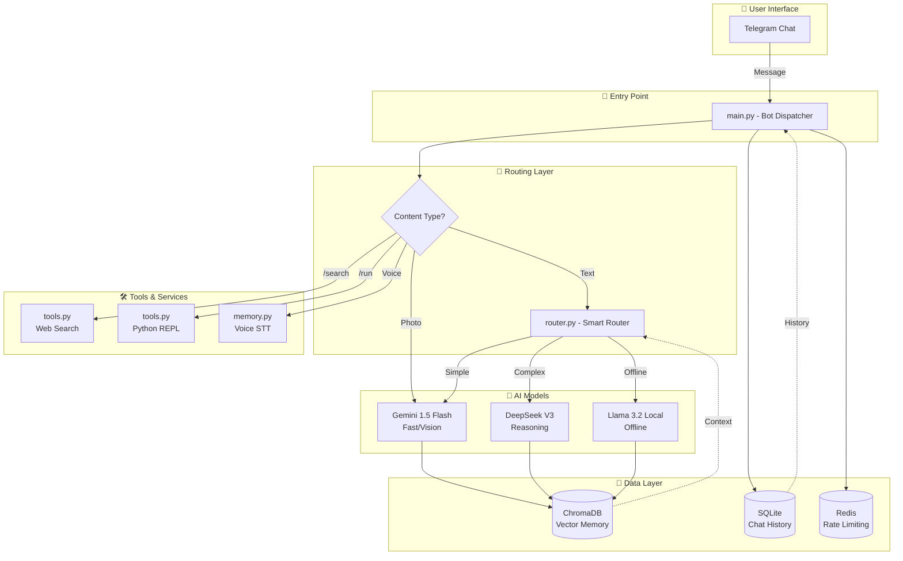
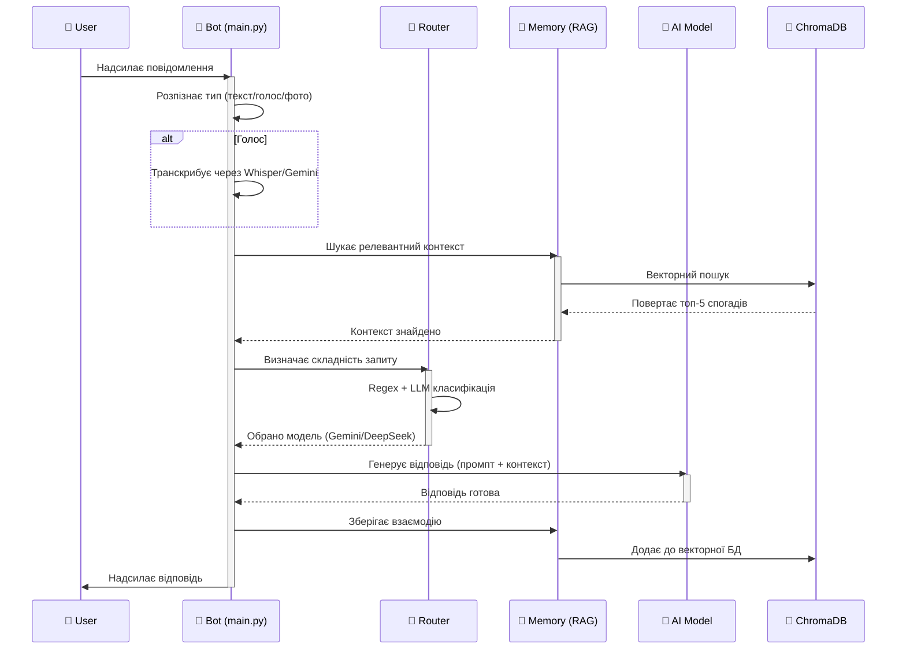
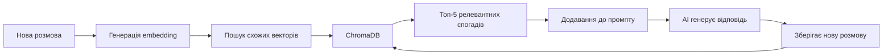

# 🤖 Архітектура AI Асистента

## 📋 Зміст
- [Огляд системи](#огляд-системи)
- [Архітектурна схема](#архітектурна-схема)
- [Можливості](#можливості)
- [Способи комунікації](#способи-комунікації)
- [Система пам'яті](#система-памяті)
- [Best Practices проектування](#best-practices-проектування)

---

## Огляд системи

**AI Асистент** - це мультимодальна агентська система, побудована на основі декількох LLM (Large Language Models) з можливістю автоматичного вибору оптимальної моделі, довготривалою пам'яттю та зовнішніми інструментами.

### Технічний стек
```
🧠 AI Models: DeepSeek V3, Gemini 1.5 Flash, Llama 3.2
💾 Databases: ChromaDB (векторна), SQLite (реляційна), Redis (кеш)
🔧 Framework: aiogram (Telegram Bot)
🐳 Deploy: Docker + Systemd (hybrid)
🔐 Security: Non-root user, env vars, sandboxed execution
```

---

## Архітектурна схема

### Високорівнева архітектура



### Детальна схема обробки запиту



---

## Можливості

### 1️⃣ Текстові запити
```
✅ Природна мова (українська/англійська)
✅ Складні міркування (DeepSeek)
✅ Швидкі відповіді (Gemini)
✅ Автоматична пам'ять минулих розмов
```

### 2️⃣ Голосові повідомлення
```
🎙️ Транскрипція через Whisper або Gemini Audio
🎙️ Обробка як звичайного текстового запиту
🎙️ Відповідь текстом
```

### 3️⃣ Візуальний аналіз
```
📸 Аналіз фотографій через Gemini Vision
📸 Розпізнавання об'єктів, текстів, сцен
📸 Відповіді на питання про зображення
```

### 4️⃣ Веб-пошук
```
🔍 Команда: /search <запит>
🔍 Використовує DuckDuckGo (безкоштовно)
🔍 Топ-5 результатів з описами та посиланнями
```

### 5️⃣ Виконання коду
```
🐍 Команда: /run <python код>
🐍 Безпечне виконання у subprocess
🐍 Таймаут 5 секунд
🐍 Без доступу до файлової системи
```

### 6️⃣ Системні команди
```
/start - Початок роботи
/help - Довідка
/stats - Статистика використання
/clear - Очистити історію чату
```

---

## Способи комунікації

### Telegram (Основний інтерфейс)
```
1. Звичайні текстові повідомлення
2. Голосові повідомлення (кнопка мікрофона)
3. Фотографії (з підписом або без)
4. Команди (/search, /run, /help)
```

### Формат запитів

#### ✅ Звичайна розмова
```
Користувач: Привіт! Як справи?
Бот: [Gemini] Привіт! Все чудово, готовий допомогти.
```

#### ✅ Складні задачі
```
Користувач: Напиши алгоритм сортування злиттям на Python
Бот: [DeepSeek] Ось реалізація merge sort...
```

#### ✅ Пошук інформації
```
Користувач: /search latest Ukraine news
Бот: 🔍 Результати пошуку для 'latest Ukraine news':
1. **Заголовок** - опис - 🔗 посилання
...
```

#### ✅ Виконання коду
```
Користувач: /run 
import math
print(f"Pi = {math.pi}")
print(f"2^10 = {2**10}")

Бот: ✅ Результат:
Pi = 3.141592653589793
2^10 = 1024
```

#### ✅ Робота з пам'яттю
```
День 1:
Користувач: Мене звати Олександр
Бот: Приємно познайомитись, Олександре!

День 5:
Користувач: Як мене звати?
Бот: [Знаходить у пам'яті] Вас звати Олександр.
```

---

## Система пам'яті

### Як працює RAG (Retrieval-Augmented Generation)



### Що зберігається
```
📝 Повідомлення користувача
🤖 Відповіді бота
📸 Описи зображень (не самі файли)
⏰ Часові мітки
🏷️ Метадані (модель, тип запиту)
```

### Як шукається
```
1. Ваш запит перетворюється у вектор (768 чисел)
2. ChromaDB шукає схожі вектори (cosine similarity)
3. Повертає топ-5 найрелевантніших спогадів
4. Ці спогади додаються до контексту для AI
```

### Приклад
```
Користувач (тиждень тому): "Моя улюблена страва - піца"
...
Користувач (сьогодні): "Що мені приготувати на вечерю?"
Бот: [Знаходить спогад про піцу]
      "Раджу піцу - це ж ваша улюблена страва!"
```

---

## Best Practices проектування

### 🎯 Загальні принципи AI Асистентів

#### 1. **Модульна архітектура**
```
✅ Розділяйте логіку на модулі (router, memory, tools)
✅ Один модуль = одна відповідальність
✅ Легко додавати нові можливості без зміни core
```

#### 2. **Гібридний підхід до моделей**
```
✅ Не покладайтеся на одну модель
✅ Швидка модель (Gemini) для простих задач
✅ Потужна модель (DeepSeek) для складних
✅ Локальна модель (Llama) для оффлайн
```

#### 3. **Контекстна пам'ять**
```
✅ Короткострокова: остання розмова (в RAM)
✅ Довгострокова: векторний пошук (ChromaDB)
✅ Не зберігайте все - фільтруйте важливе
```

#### 4. **Безпека перш за все**
```
🔐 Ніколи не hardcode API ключі
🔐 Обмежуйте виконання коду (timeout, sandbox)
🔐 Валідуйте вхідні дані
🔐 Rate limiting для захисту від зловживань
```

#### 5. **Observability (Спостерігаємість)**
```
📊 Логувань всіх запитів та відповідей
📊 Метрики (час відповіді, використана модель)
📊 Моніторинг помилок
📊 Дашборди для аналізу
```

---

### 🏗️ Рекомендовані фреймворки

#### Для Python-based асистентів:
```
🔹 LangChain - найпопулярніший фреймворк для LLM-додатків
   └─ Chains, Agents, Memory, Tools
   
🔹 LlamaIndex - спеціалізація на RAG та індексації даних
   └─ Відмінний для документ-орієнтованих асистентів
   
🔹 Haystack - enterprise-ready NLP фреймворк
   └─ Для складних пайплайнів з кількома моделями
   
🔹 AutoGen (Microsoft) - багатоагентні системи
   └─ Коли потрібна співпраця кількох AI-агентів
```

#### Для управління промптами:
```
🔹 PromptLayer - версіонування та A/B тестування промптів
🔹 LangSmith - дебагінг та моніторинг LLM-додатків
🔹 Weights & Biases - експерименти та метрики
```

---

### 🎨 Архітектурні патерни

#### Pattern 1: **Router Pattern** (ваш поточний)
```
Запит → Класифікатор → Обрана модель → Відповідь
```
**Плюси**: Економія ресурсів, швидкість
**Мінуси**: Можливі помилки класифікації

#### Pattern 2: **Ensemble Pattern**
```
Запит → [Модель A, Модель B, Модель C] → Агрегація → Відповідь
```
**Плюси**: Висока точність
**Мінуси**: Дорого, повільно

#### Pattern 3: **Chain-of-Thought Pattern**
```
Запит → Планування → Виконання кроків → Верифікація → Відповідь
```
**Плюси**: Складні міркування
**Мінуси**: Багато викликів LLM

#### Pattern 4: **ReAct (Reasoning + Acting)**
```
Запит → [Think → Act → Observe] (цикл) → Відповідь
```
**Плюси**: Автономність, використання інструментів
**Мінуси**: Складність дебагу

---

### 📝 Чеклист якісного асистента

```
✅ Чи розуміє асистент контекст розмови?
✅ Чи може він пам'ятати минулі взаємодії?
✅ Чи швидко він відповідає (< 5 сек)?
✅ Чи є fallback механізм при збоях?
✅ Чи захищені API ключі?
✅ Чи логуються всі запити для дебагу?
✅ Чи може він працювати 24/7 без втручання?
✅ Чи є Rate Limiting для захисту від спаму?
✅ Чи зрозумілі повідомлення про помилки?
✅ Чи є документація для користувачів?
```

---

## 🔮 Можливі покращення

### Короткострокові (1-2 тижні)
```
🔹 Function Calling - AI сам визначає коли викликати /search чи /run
🔹 Більше команд (/summarize, /translate, /explain)
🔹 Підтримка документів (PDF, DOCX)
```

### Середньострокові (1-2 місяці)
```
🔹 Web Dashboard для перегляду історії
🔹 Контроль доступу (різні ролі користувачів)
🔹 Інтеграція з календарем/нотатками
```

### Довгострокові (3+ місяців)
```
🔹 Багатоагентна система (спеціалізовані агенти)
🔹 Fine-tuning на ваших даних
🔹 Voice-to-Voice (повноцінні голосові діалоги)
```

---

## 📚 Ресурси для вивчення

### Книги
- "Building LLM Apps" - Valentina Alto
- "Generative AI with LangChain" - Ben Auffarth
- "AI Engineering" - Chip Huyen

### Курси
- DeepLearning.AI - "LangChain for LLM Application Development"
- Andrew Ng - "AI Agents in LangGraph"
- Fast.ai - "Practical Deep Learning for Coders"

### Комʼюніті
- r/LocalLLaMA - Reddit спільнота
- LangChain Discord
- Hugging Face Forums

---

**Дата створення**: 2026-01-31  
**Версія системи**: 1.0 (Production Ready)  
**Автор**: AI + Human Collaboration
