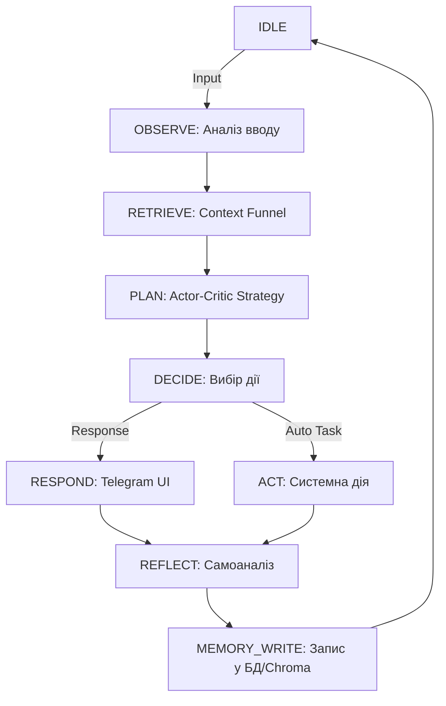

# 🤖 Delio Assistant (AID) v3.0

> **Sovereign Personal AI Kernel.**
> Побудований на базі архітектури **FSM (Finite State Machine)** з когнітивним циклом Actor-Critic.


---

## 🏗️ Архітектура Ядра (AID Kernel)

Delio більше не є простим Telegram-ботом. Це автономне ядро, яке працює за циклом **Observe-Plan-Act-Reflect**.

### Схема Когнітивного Циклу
Кожне повідомлення або системна подія (Heartbeat) проходить через наступні стани:



---

## 🧠 Ключові Фішки (Features)

### 1. **Context Funnel (Воронка Контексту)**
Об'єднує 3 типи пам'яті для кожного запиту:
- **Short-term**: Останні повідомлення діалогу (Redis).
- **Long-term**: Векторний пошук фактів через ChromaDB.
- **Structured**: 9 вимірів життя у SQLite (Life Map, Goals, Resource State).

### 2. **Actor-Critic Synergy**
- **Actor (Gemini 2.0/2.5)**: Генерує креативну та швидку відповідь.
- **Critic (DeepSeek V3)**: Невидимий валідатор, що перевіряє відповідь на логічність, безпеку та відповідність Life Level користувача.

### 3. **Autonomous Heartbeat**
Бот "живе" навіть коли ви мовчите. Кожні 15 хвилин FSM активує стан `heartbeat` для:
- Аналізу пропущених завдань.
- Оновлення профілів пам'яті.
- Самотрансформації (Self-improvement).

---

## 📂 Структура Проекту

```text
/root/ai_assistant/
├── core/               # AID Kernel
│   ├── fsm.py          # State Machine Controller
│   ├── context.py      # Execution Context (Shared State)
│   └── memory/         # Context Funnel Logic
├── states/             # State Handlers (OBSERVE, PLAN, etc.)
├── data/               # Persistent Storage (SQLite, ChromaDB)
├── personas/           # AI Core Identities
├── tools/              # Available Actions (Search, Code Exec)
└── main.py             # System Entry Point
```

---

## 🚀 Швидкий Старт

### 1. Підготовка оточення
```bash
python3 -m venv venv
source venv/bin/activate
pip install -r requirements.txt
```

### 2. Конфігурація
Налаштуйте ключі у `.env`:
- `TG_TOKEN` (Telegram Bot API)
- `GEMINI_KEY` (Google AI Studio)
- `DEEPSEEK_KEY` (DeepSeek Platform)

### 3. Запуск
```bash
python main.py
```

---

## 🛠️ Команди

- `/start` — Перезапуск ядра та статистика.
- `/memory` — Перегляд вашої структурованої пам'яті (9 секторів).
- `/interview` — Режим поповнення пам'яті через опитування.
- `/logic` — Аналіз останньої відповіді (чому було обрано таку модель/стратегію).

---

## 📂 Проектна Документація (AID Knowledge Base)

Вся детальна інформація про роботу модулів тепер структурована у папці `docs/`:

- **[🗺️ Повний Індекс (ENTRY POINT)](docs/INDEX.md)** — почніть звідси.
- **[🚶 Walkthrough (Історія міграції)](docs/SYSTEM_WALKTHROUGH.md)** — як бот став ядром.
- **[🛡️ Безпека та FSM](docs/CORE_FSM.md)** — як працює State Guard.
- **[🧠 Пам'ять (Funnel)](docs/MEMORY_FUNNEL.md)** — як працює об'єднання контексту.

---

## 📂 Структура Проекту

```text
/root/ai_assistant/
├── core/               # AID Kernel (FSM, Guard, Context)
├── states/             # Cognitive Handlers (Observe, Plan, Act...)
├── legacy/             # Попередні модулі (Backend Dependencies)
├── docs/               # Повна документація проекту
├── config/             # YAML Конфігурації
├── scripts/            # Скрипти запуску та деплою
├── data/               # SQLite & ChromaDB
└── logs/               # Системні логи
```

---

## 🚀 Швидкий Старт
Дивіться **[SETUP_GUIDE.md](docs/SETUP_GUIDE.md)** для детальних інструкцій.

---
**Version:** 3.0.0-AID  
**Maintainer:** Antigravity (AID Migration Architect)
